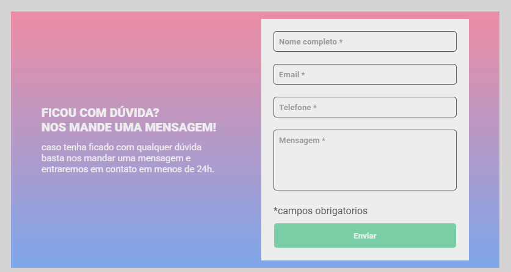
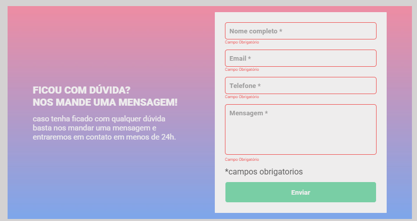
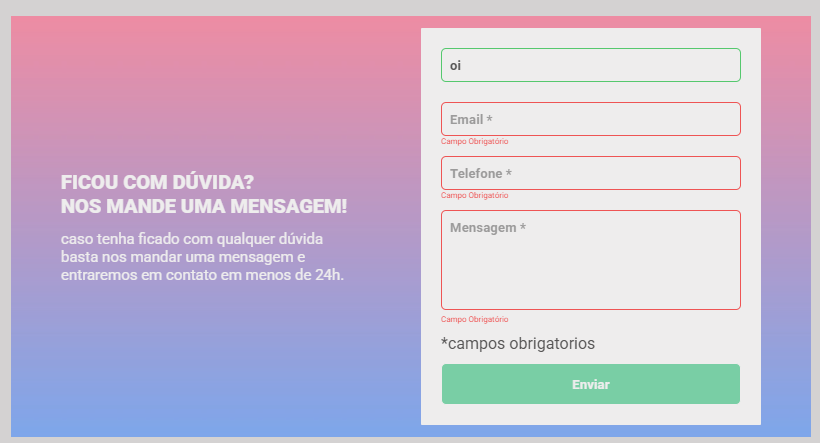

# Formulario de validação 

Esse projeto vai fazer a validação dos campos de um formulário, para quaando estiver vazio e clicar em enviar ira acusar os campos que estão vazio colocando um contorno vermelho, mas se não estiver vai ficar verde. 

## 📸 Demonstração

### Página inicial:

### Campos vazios:

### Campos preenchidos:

## 🚀 Tecnologias

- HTML
- CSS
- JavaScript

